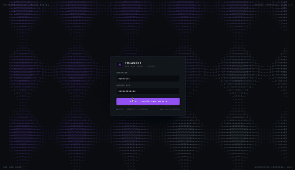
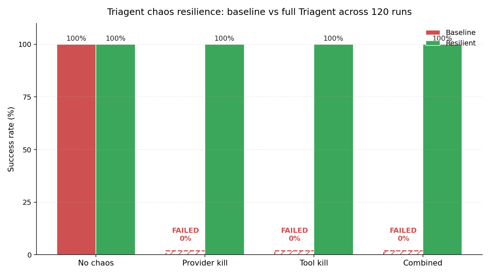

# Triagent

**Resilient AI incident-response agent.** Investigates failing Kubernetes pods, reasons across multiple LLM providers, and keeps working when its own tools and providers fail under chaos.

[**Live demo →**](https://warroom-ten-henna.vercel.app/?demo=1) · [**Video →**](https://youtu.be/MDWHRFjFh7U) · Built for the **TrueFoundry Resilient Agents** track at DevNetwork [AI+ML] 2026.



---

## Why it exists

Every team building production AI agents in 2026 hits the same wall: agents are too fragile to put on-call. One provider brownout, one bad tool response, one runaway token budget, and the agent stalls. Triagent is built around the opposite assumption — that infrastructure under the agent *will* fail, and the agent must keep working anyway.

| | Baseline agent | Triagent |
|---|---|---|
| No chaos | 100% success | **100%** success |
| Primary provider killed | 0% | **100%** |
| Tool poisoned mid-run | 0% | **100%** |
| Provider + tool chaos combined | 0% | **100%** |

*120-investigation eval, 3 scenarios × 4 chaos modes × 2 systems × 5 replicas.*



---

## How it works

Triagent runs every LLM call through the **TrueFoundry AI Gateway**, with three real model families behind one endpoint (Groq Llama-3.3-70B, Google Gemma, OpenRouter Arcee) and Ollama as a last-ditch fallback outside the gateway.

Three primitives sit on top of TF:

1. **Brownout-aware fallback chain** — `tf-primary → tf-verify → tf-tertiary → ollama → mock`. Walks the chain on `ProviderError` and on EWMA-detected slow providers (alpha=0.3, brownout threshold 8000ms).
2. **MCP-style tool quarantine** — every tool sits behind a quarantine-aware registry. Kill `kubectl` mid-investigation → the agent substitutes Prometheus and emits `tool_substitute` to the trace.
3. **Cross-provider ensemble verify** — the hypothesize step runs on one TF-routed model; verify runs on a *different* family. Disagreement surfaces as `DIVERGENT` on the verdict card.

Plus three production primitives the gateway alone doesn't provide:

- **Cost-aware fallback** — under budget pressure, free TF-routed models jump ahead of paid ones; skipped providers emit `provider_skip` events
- **Counterfactual replay** — `POST /investigations/{id}/replay` with a `chaos_override` spawns a paired investigation that re-runs from any step with a different chaos state
- **Token budget breaker** — hard cap per investigation; cost-by-provider attributed live in the verdict card

---

## Quickstart

```bash
git clone https://github.com/SyaugiAlkaf/triagent
cd triagent
make install
cp .env.example .env
# Add TRUEFOUNDRY_API_KEY from signup.truefoundry.com (free Developer tier)
# Plug Groq + Gemini + OpenRouter in the TF dashboard as providers
make cluster   # ensure k3d-dc is up
make dev       # api :8000 + engine :8002 + war room :3000
```

Open `http://localhost:3000`, click an alert, press **CHAOS**, kill any provider, and watch the agent reroute live.

### Eval harness

```bash
make engine                                            # separate shell
.venv/bin/python -m eval.harness                       # ~5s in mock mode
.venv/bin/python -m eval.plot                          # writes eval/results/chaos_eval.png
```

### Frontend-only demo (no backend)

The war room ships with a scripted demo mode for clickable submissions:

```bash
cd warroom
VITE_DEMO_MODE=true npm run build
npx vite preview --port 4173
open http://127.0.0.1:4173/?demo=1
```

Deploys to Vercel out of the box via the included `warroom/vercel.json`.

---

## Stack

| Layer | Choice |
|---|---|
| Routing | TrueFoundry AI Gateway (`gateway.truefoundry.ai`) |
| Models | `tf-primary` Groq · `tf-verify` Gemini · `tf-tertiary` OpenRouter |
| Last-ditch fallback | Ollama-direct (`qwen2.5:latest`) outside the gateway |
| Orchestration | LangGraph 1.0 |
| Backend | FastAPI · pydantic v2 · httpx · uvicorn |
| Frontend | Vite · React 19 · TypeScript · Tailwind v4 · Zustand · Motion · React Three Fiber |
| Tools | `kubectl` · Prometheus · Loki — MCP-style registry with quarantine |
| Cluster | k3d (`k3d-dc` context) |
| Process orchestration | honcho via `Procfile` |
| Eval | Python · matplotlib |

---

## Architecture

```
┌────────────────────────────────────────────────────┐
│ War room — Vite + React 19 + R3F                   │
│   AlertInbox · IncidentDetail · TopologyScene (3D) │
│   ReplayModal · EvalModal · ChaosConsole           │
│   Zustand store · single reconnecting /ws          │
└────────────────────────────────────────────────────┘
       ▲ /ws push          ▲ /api/* HTTP
       │                   │
┌────────────────────────────────────────────────────┐
│ FastAPI :8000 — agent + WebSocket + REST           │
│   LangGraph: plan → investigate → hypothesize →    │
│              verify                                │
│   Resilient Gateway wrapper (app/gateway.py):      │
│     fallback chain · EWMA reorder · cost breaker   │
│     ensemble verify · cost-aware routing           │
│   MCP-style tool registry with quarantine          │
└────────────────────────────────────────────────────┘
       │ OpenAI-compatible HTTPS
       ▼
┌────────────────────────────────────────────────────┐
│ TrueFoundry AI Gateway                             │
│   Virtual models → upstream provider keys (BYOK):  │
│     groq/llama-3.3-70b-versatile                   │
│     google-gemini/gemma-4-31b-it                   │
│     openrouter/arcee-ai-trinity-large-thinking-free│
└────────────────────────────────────────────────────┘
```

Full diagram + investigation lifecycle in [`docs/architecture.md`](docs/architecture.md).

---

## Demo scenarios

| Slug | What breaks | Investigation path |
|---|---|---|
| `01-crashloop` | Container exits non-zero — missing `DATABASE_URL` | kubectl get → describe → root cause |
| `02-oom` | Worker OOMKilled cascade (memory leak) | kubectl events → Prometheus memory metrics |
| `03-dns` | CoreDNS panic from invalid Corefile (chaos-amplified) | kubectl quarantined → Prometheus substituted → verdict via fallback model |

---

## Repo layout

```
app/                  FastAPI backend + LangGraph agent
  gateway.py            TF Gateway wrapper, fallback chain, EWMA, cost attribution
  tools/                kubectl · prometheus · loki — MCP-style registry
  graph/                plan → investigate → hypothesize → verify
scenario_engine/      FastAPI :8002 — canned cluster telemetry
scenarios/            YAML manifests: crashloop / oom / dns-chaos
eval/                 Chaos harness + matplotlib plot
warroom/              React war room (Vite + R3F + Motion + Zustand)
video-cinema/         HyperFrames 53s demo reel
docs/                 architecture · screenshots · demo gif
tests/                pytest suite
```

---

## License

MIT — see [`LICENSE`](LICENSE).
