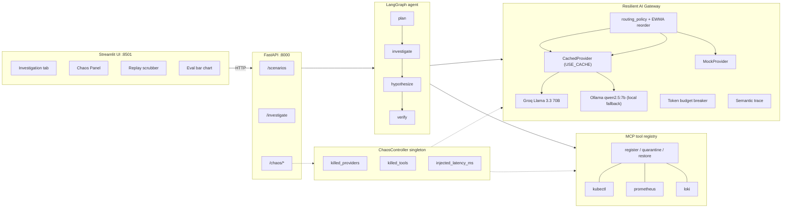

# Architecture

Triagent is a LangGraph state machine driving a brownout-aware LLM gateway and
an MCP-style tool registry. The Chaos Panel is wired straight into the same
runtime path - there is no demo-only code shadowing the production graph.

## System diagram

## Investigation lifecycle

1. `POST /investigate?scenario=...` loads the scenario YAML, renders it to a
   real K8s Deployment + ConfigMap, applies to `k3d-dc`, waits for the pod
   to reach an unhealthy state.
2. The LangGraph agent invokes:
   - **plan** records the kubectl/prometheus playbook in the trace.
   - **investigate** queries `kubectl` (or falls back to `prometheus` if
     `kubectl` is quarantined). Findings are appended to state.
   - **hypothesize** sends `{system, scenario, findings}` to the gateway,
     receives a ranked list of hypotheses with per-item confidence.
   - **verify** confirms the top hypothesis and emits a root-cause statement
     plus remediation.
3. Each gateway call records a `provider_call` trace event with `in/out`
   tokens, EWMA-smoothed latency, and per-call cost.
4. If a chaos toggle fires mid-run, the trace also carries
   `chaos_inject -> provider_error -> provider_fallback` or
   `chaos_inject -> tool_quarantine -> tool_substitute` events.
5. `/investigate` returns `{root_cause, confidence, hypotheses, findings,
   trace, latency_ms, tokens_spent, cost_usd, cost_by_provider}`.

## The six features and where they live

| # | Feature | Code |
|---|---|---|
| 1 | Brownout-aware fallback chain | `Gateway.complete` walks `routing_policy`, falls through on `ProviderError`. EWMA per-provider latency reorders slow providers to the tail. |
| 2 | MCP tool quarantine | `app/tools/__init__.py` registry + `ChaosController.killed_tools` + `_investigate_via_prometheus` substitute path in the agent. |
| 3 | Latency-aware routing | `_Ewma` (alpha=0.3) per provider; `latency_brownout_ms=8000` reorders slow providers to the tail before the next call. |
| 4 | Semantic observability + replay | Every state transition appends to `gateway.trace`. Replay tab in the UI scrubs over event indices and renders the payload. |
| 5 | Token budget breaker + cost attribution | `gateway.tokens_spent`, `BudgetExceeded`, `estimate_cost_usd` using public Groq rates. Per-provider cost surfaced in the result card. |
| 6 | Eval harness with chaos injection | `eval/harness.py` runs 120 mock-mode runs across (3 scenarios x 4 chaos modes x 2 systems x 5 replicas), `eval/plot.py` emits `eval/results/chaos_eval.png`. |

## Why this shape and not "multi-agent swarm"

Sai Krishna's track is "resilient agents," not "more agents." The brownout
fallback chain, MCP quarantine, latency-aware routing, and the eval harness
each map 1:1 to a TrueFoundry product surface (TrueFailover / AI Gateway /
session introspection / cost attribution). The state machine stays
deterministic so the trace is reproducible and the Chaos Panel button presses
produce the same recovery path every time.
